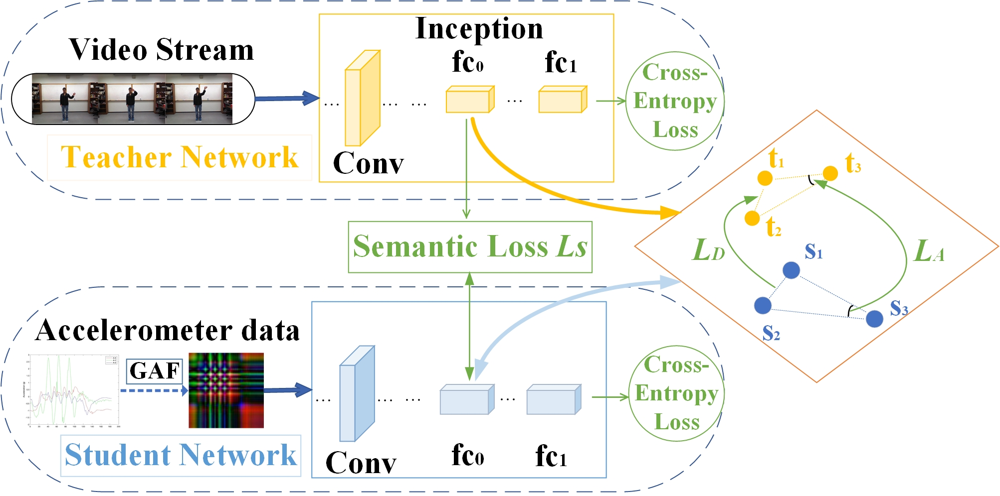
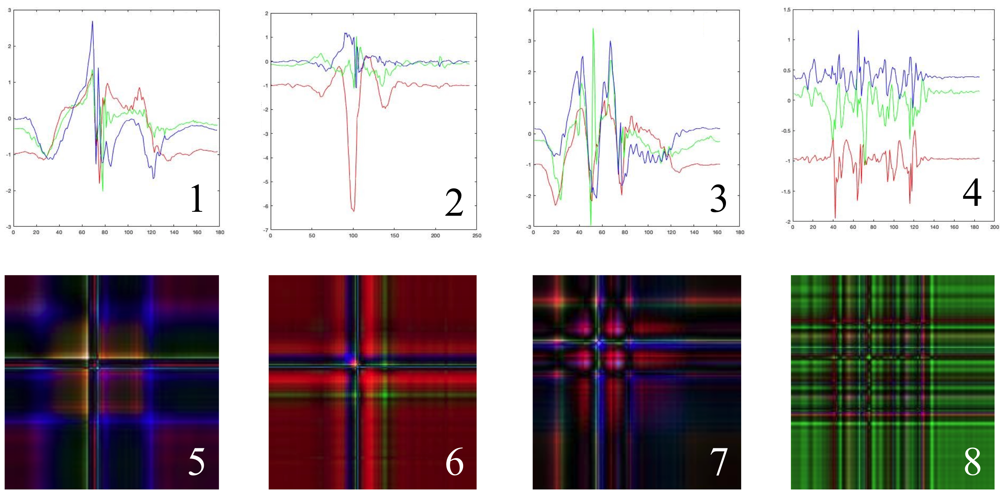

# Crossmodal KD 

Cross-Modal Knowledge Distillation For Vision-To-Sensor Action Recognition (ICASSP-2022): https://ieeexplore.ieee.org/document/9746752

Homepage: [https://jiany-ctrl.github.io/](https://jiany-ctrl.github.io/)

## Abstract
Human activity recognition (HAR) based on multi-modal approach has been recently shown to improve the accuracy performance of HAR. However, restricted computational resources associated with wearable devices, i.e., smartwatch, failed to directly support such advanced methods. To tackle this issue, this study introduces an end-to-end Vision-to-Sensor Knowledge Distillation (VSKD) framework. In this VSKD framework, only time-series data, i.e., accelerometer data, is needed from wearable devices during the testing phase. Therefore, this framework will not only reduce the computational demands on wearable devices, but also produce a learning model that closely matches the performance of the computational expensive multi-modal approach. In order to retain the local temporal relationship and facilitate visual deep learning models, we first convert time-series data to two-dimensional images by applying the Gramian Angular Field (GAF) based encoding method. We adopted multi-scale TRN with BN-Inception and ResNet18 as the teacher and student network in this study, respectively. A novel loss function, named Distance and Angle-wised Semantic Knowledge loss (DASK), is proposed to mitigate the modality variations between the vision and the sensor domain. Extensive experimental results on UTD-MHAD, MMAct, and Berkeley-MHAD datasets demonstrate the competitiveness of the proposed VSKD model which can be deployed on wearable devices.

## Framework

Figure 1: Schematic overview of the proposed VSKD method.


## Datasets
[UTD-MHAD](https://personal.utdallas.edu/~kehtar/UTD-MHAD.html)        
[Berkeley-MHAD](https://tele-immersion.citris-uc.org/berkeley_mhad/)           
[MMAct](https://mmact19.github.io/2019/)  

## GAF examples

Figure 2: Selected sensor (top) and their corresponding GAF images (bottom) in UTD-MHAD [12] : (1) basketball shooting; (2) bowling; (3) knock on door and (4) walking.

## Citation
If you find this repository useful, please consider citing the following paper:


```
@inproceedings{ni2022cross,
  title={Cross-modal knowledge distillation for Vision-to-Sensor action recognition},
  author={Ni, Jianyuan and Sarbajna, Raunak and Liu, Yang and Ngu, Anne HH and Yan, Yan},
  booktitle={ICASSP 2022-2022 IEEE International Conference on Acoustics, Speech and Signal Processing (ICASSP)},
  pages={4448--4452},
  year={2022},
  organization={IEEE}
}
```


